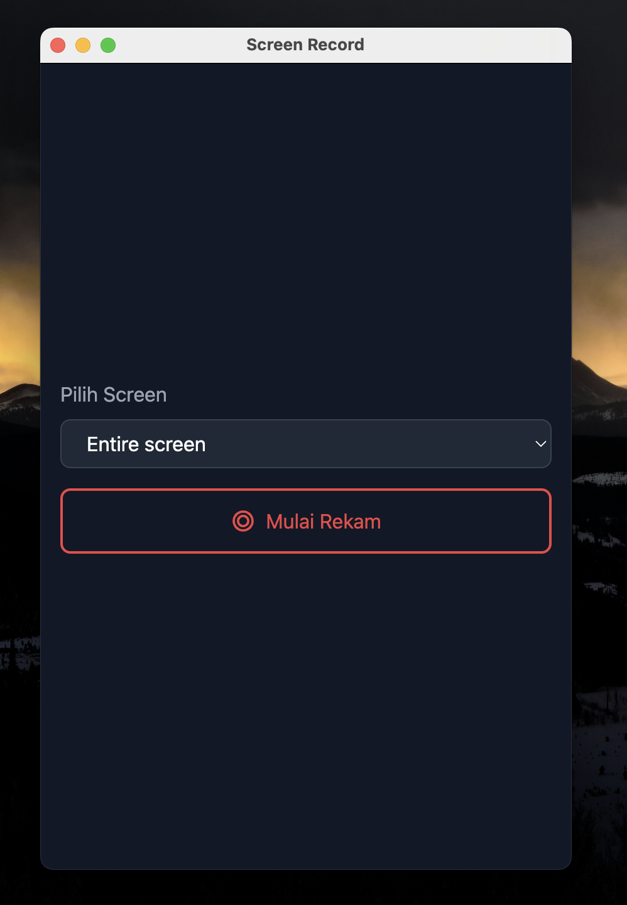
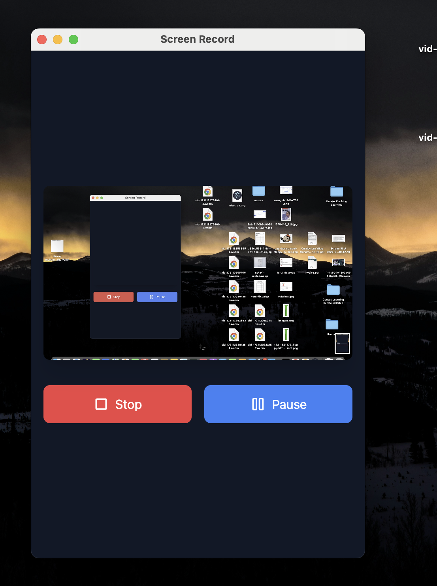
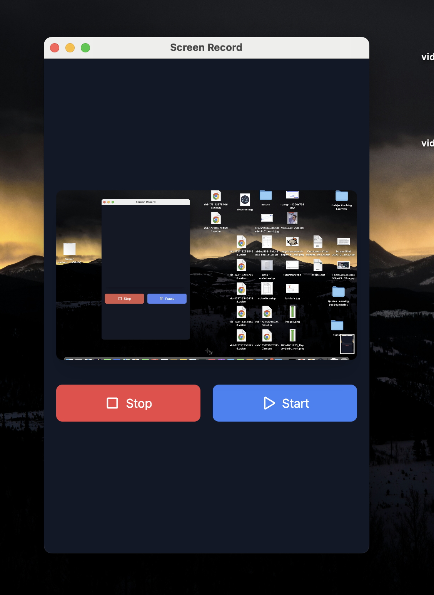
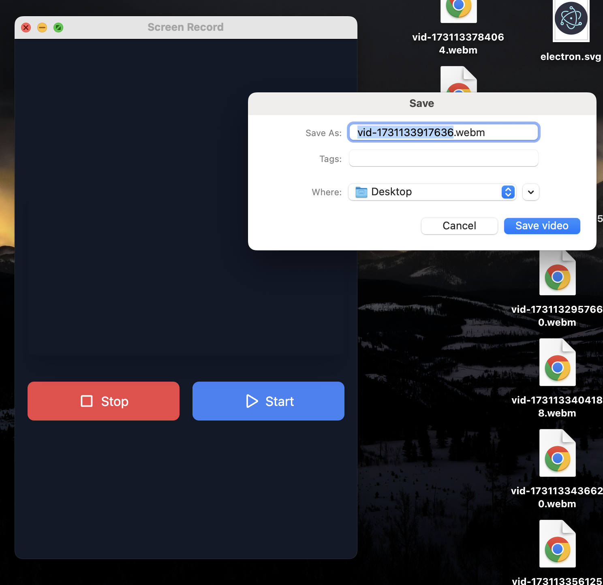

# electron-app

An Screen Record application with React and TypeScript

## Screenshots

### Main Interface


_Main application window with recording controls_

### Settings Panel


_Configuration options for video recording_

### Pause State


_Pause State_

### Settings Panel


_Save File_

## Recommended IDE Setup

- [VSCode](https://code.visualstudio.com/) + [ESLint](https://marketplace.visualstudio.com/items?itemName=dbaeumer.vscode-eslint) + [Prettier](https://marketplace.visualstudio.com/items?itemName=esbenp.prettier-vscode)

## Project Setup

### Install

```bash
$ yarn
```

### Development

```bash
$ yarn dev
```

### Build

```bash
# For windows
$ yarn build:win

# For macOS
$ yarn build:mac

# For Linux
$ yarn build:linux
```
